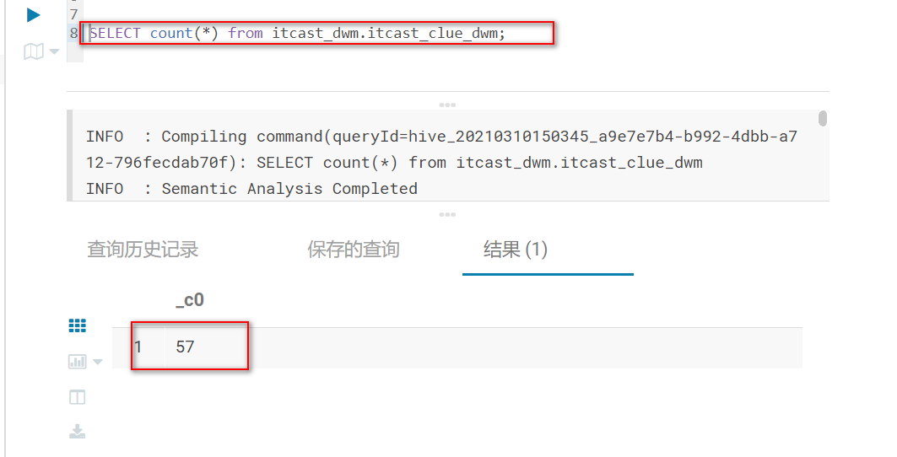
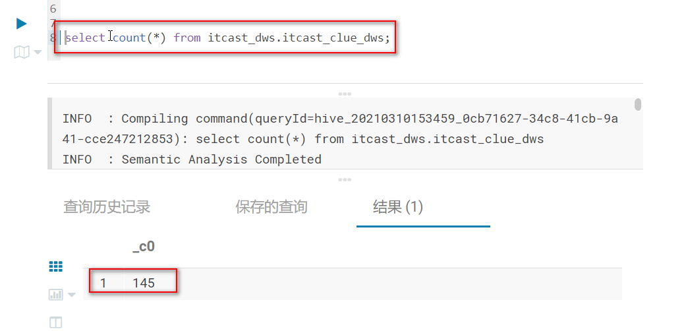

## 1- 报名用户主题看板_需求分析

### 校区报名量

- 需求：统计期内，全部报名客户中，各校区报名人数分布。

``` properties

	
指标:报名人数
维度:
    时间维度:  年 月  天 小时
  	线上线下
  	校区维度

涉及到表: 
	customer_relationship意向表
	itcast_clazz报名课程表

涉及到字段:
	customer_relationship意向表
		cr.itcast_clazz_id	报名id
		cr.payment_state 付款状态 'PAID'表示已经付款
		cr.payment_time 付款时间
		线上线下维度: origin_type 
    	    判断依据:  当这个字段的值 等于 NETSERVICE 或者 PRESIGNUP 都认为线上, 否则为线下
    	    此处可以有转换操作: 将 origin_type 转换为 origin_type_stat
    	        新的字段只会有二个字段  1(线上)  和 0(线下)
		
	itcast_clazz报名课程表 
		id 
		itcast_school_id
		itcast_school_name '校区名称' 

关联条件: 
	意向表.itcast_clazz_id = 报名表.id
	

```


### 学科报名量

- 需求：统计期内，全部报名客户中，各学科报名人数分布

``` properties

	
指标:报名人数
维度:
    时间维度:  年 月  天 小时
  	线上线下
  	学科维度

涉及到表: 
	customer_relationship意向表
	itcast_clazz报名课程表

涉及到字段:
	customer_relationship意向表
		cr.itcast_clazz_id	报名id
		cr.payment_state 付款状态 'PAID'表示已经付款
		cr.payment_time 付款时间
		
		线上线下维度: origin_type 
    	    判断依据:  当这个字段的值 等于 NETSERVICE 或者 PRESIGNUP 都认为线上, 否则为线下
    	    此处可以有转换操作: 将 origin_type 转换为 origin_type_stat
    	        新的字段只会有二个字段  1(线上)  和 0(线下)
		
	itcast_clazz报名课程表 
		id 
		itcast_subject_id 
		itcast_subject_name '学科名称'

关联条件: 
	意向表.itcast_clazz_id = 报名表.id
	

```


### 总报名量

- 需求: 统计期内，已经缴费的报名客户总量

``` properties

	
指标:报名人数
维度:
    时间维度:  年 月  天 小时
  	线上线下

涉及到表: 
	customer_relationship意向表

涉及到字段:
	customer_relationship意向表
		cr.payment_state 付款状态 'PAID'表示已经付款
		cr.payment_time 付款时间
		线上线下维度: origin_type 
    	    判断依据:  当这个字段的值 等于 NETSERVICE 或者 PRESIGNUP 都认为线上, 否则为线下
    	    此处可以有转换操作: 将 origin_type 转换为 origin_type_stat
    	        新的字段只会有二个字段  1(线上)  和 0(线下)
		
	

关联条件: 
	无
	

```


### 意向用户报名转化率

- 需求：统计期内，意向客户中报名的客户占比。全部报名人数/全部意向人数

``` properties
两个指标: 总报名人数 、 总意向人数（已经在意向主题里面完成）
指标: 总表名人数
维度:
    时间维度:  年 月  天 小时
  	线上线下
  	
总报名人数可以参考需求:总报名量
```


### 有效线索报名转化率

- 需求：线上报名量/线上有效线索量，与上一个指标类似，此处的线索量需要排除已申诉数据。

``` properties
两个指标: 总报名人数 、 有效线索总量（已经在有效线索主题里面完成）
指标: 总表名人数
维度:
    时间维度:  年 月  天 小时
  	线上线下
  	
总报名人数可以参考需求:总报名量
```


### 日报名趋势

- 需求：统计期内，每天报名人数的趋势图

``` properties
两个指标: 总报名人数 、 有效线索总量（已经在有效线索主题里面完成）
指标: 总表名人数
维度:
    时间维度:  年 月  天 小时
  	线上线下
  	
总报名人数可以参考需求:总报名量
```


### 校区学科的报名学员TOP

- 需求：统计期内，全部报名学员中，校区学科排行榜，topN。A校区b学科第一，B校区a学科第二等等。

``` properties
两个指标: 总报名人数 、 有效线索总量（已经在有效线索主题里面完成）
指标: 总表名人数
维度:
    时间维度:  年 月  天 小时
  	线上线下
  	校区维度
  	学科维度
  	
涉及到表: 
	customer_relationship意向表
	itcast_clazz报名课程表

涉及到字段:
	customer_relationship意向表
		cr.itcast_clazz_id	报名id
		cr.payment_state 付款状态 'PAID'表示已经付款
		cr.payment_time 付款时间
		线上线下维度: origin_type 
    	    判断依据:  当这个字段的值 等于 NETSERVICE 或者 PRESIGNUP 都认为线上, 否则为线下
    	    此处可以有转换操作: 将 origin_type 转换为 origin_type_stat
    	        新的字段只会有二个字段  1(线上)  和 0(线下)
		
	itcast_clazz报名课程表 
		id 
		itcast_school_id '校区ID'
		itcast_school_name '校区名称' 
		itc.itcast_subject_id '学科ID'
	    itc.itcast_subject_name '学科名称'

关联条件: 
	意向表.itcast_clazz_id = 报名表.id
```


### 来源渠道占比

- 需求：统计期内，全部报名学员中，不同来源渠道的报名学员占比情况。

``` properties
两个指标: 总报名人数 、 有效线索总量（已经在有效线索主题里面完成）
指标: 总表名人数
维度:
    时间维度:  年 月  天 小时
  	线上线下
  	来源渠道
  	
涉及到表: 
	customer_relationship意向表
	itcast_clazz报名课程表

涉及到字段:
	customer_relationship意向表
		cr.itcast_clazz_id	报名id
		cr.payment_state 付款状态 'PAID'表示已经付款
		cr.payment_time 付款时间
		cr.origin_type 来源渠道
		线上线下维度: origin_type 
    	    判断依据:  当这个字段的值 等于 NETSERVICE 或者 PRESIGNUP 都认为线上, 否则为线下
    	    此处可以有转换操作: 将 origin_type 转换为 origin_type_stat
    	        新的字段只会有二个字段  1(线上)  和 0(线下)
		
	

关联条件: 
	无
```


### 咨询中心报名贡献

- 需求：统计期内，全部报名学员中，各咨询中心的报名学员人数占比情况。

``` properties
两个指标: 总报名人数 、 有效线索总量（已经在有效线索主题里面完成）
指标: 总表名人数
维度:
    时间维度:  年 月  天 小时
  	线上线下
  	咨询中心
  	
涉及到表: 
	customer_relationship意向表
	employee员工表
	scrm_department部门表

涉及到字段:
	customer_relationship意向表
		creator 员工ID
		cr.payment_state 付款状态 'PAID'表示已经付款
		cr.payment_time 付款时间
		线上线下维度: origin_type 
    	    判断依据:  当这个字段的值 等于 NETSERVICE 或者 PRESIGNUP 都认为线上, 否则为线下
    	    此处可以有转换操作: 将 origin_type 转换为 origin_type_stat
    	        新的字段只会有二个字段  1(线上)  和 0(线下)

	employee员工表
		id 员工ID
		tdepart_id 部门ID
		
	scrm_department部门表
		name 部门名称

关联条件: 
	意向表.creator = 员工表.id 
	员工表.tdepart_id = 部门表.id
```


### 报名用户主题需求分析总结

``` properties
指标: 报名用户量 (也就意味着在DWS层只有一个表即可)

维度: 
   	固有维度:
       	时间维度: 年 月 天 小时
      	线上线下
   	产品属性维度:
   		总报名量
   		来源渠道
   		咨询中心
   		校区维度
	  	学科维度
   		
   

涉及到表:  
    customer_relationship意向表
    itcast_clazz报名课程表
	employee员工表
	scrm_department部门表

三个表的关联条件(至少2个条件):
	意向表.itcast_clazz_id = 报名表.id
    意向表.creator = 员工表.id 
	员工表.tdepart_id = 部门表.id

涉及到字段: 
   
	customer_relationship意向表
		customer_id  指标字段
		cr.itcast_clazz_id	报名id
		creator 员工ID
		cr.payment_state 付款状态 'PAID'表示已经付款
		cr.payment_time 付款时间 -- 转换为 payment_time_year,payment_time_month,payment_time_day payment_time_hour
		cr.origin_type 来源渠道
		线上线下维度: origin_type 
    	    判断依据:  当这个字段的值 等于 NETSERVICE 或者 PRESIGNUP 都认为线上, 否则为线下
    	    此处可以有转换操作: 将 origin_type 转换为 origin_type_stat
    	        新的字段只会有二个字段  1(线上)  和 0(线下)
	itcast_clazz报名课程表
		id 
		itcast_school_id '校区ID'
		itcast_school_name '校区名称' 
		itc.itcast_subject_id '学科ID'
	    itc.itcast_subject_name '学科名称'
	employee员工表
		id
		tdepart_id 		部门ID.
 	scrm_department部门表
 		name 部门名称
		

整理需要转换和清洗的操作:
   清洗操作:
       将标记为删除的数据进行清洗 itcast_ods.customer_relationship where deleted = 0
   转换操作:
       1) customer_relationship意向表将origin_type 转换后(上卷)得到origin_type_stat(线上线下)
       2) customer_relationship意向表将payment_time 转换为 payment_time_year,payment_time_month,payment_time_day payment_time_hour


注意: 报名数据不存在重复数据，所以在DWM层需要做细颗粒聚合操作，根据小时先聚合操作;
```


## 2- 报名用户主题看板_建模分析

``` properties
涉及到表:
    事实表: 
	    customer_relationship意向表
    
    维度表:
       	itcast_clazz报名课程表
		employee员工表
		scrm_department部门表
```


### ODS层:

``` properties
共计为一张表:
	
	customer_relationship意向表:已经在意向主题看板中添加了。
	
```


### DW层:

#### DWD:明细层

- 作用:  清洗转换操作  和 少量维度退化操作(本主题没有再dwd层维度退化操作)
- 需要清洗什么, 以及需要转换什么

``` properties
DWD层表字段组合:  清洗字段 + 转换后的字段 + 事实表必须要的字段 +事实表和其他表关联字段

需要转换和清洗的操作:
	清洗操作:
       将标记为删除的数据进行清洗  delete
       
   	转换操作:
       1) 意向表中将origin_type 转换为 origin_type_stat(线上线下)
       		判断依据:  当这个字段的值 等于 NETSERVICE 或者 PRESIGNUP 都认为线上, 否则为线下
    	    此处可以有转换操作: 将 origin_type 转换为 origin_type_stat
    	        新的字段只会有二个字段  1(线上)  和 0(线下)
       2) 意向表中将payment_time 转换为  	payment_time_year,payment_time_month,payment_time_day payment_time_hour
      

		
所有字段:
id,
customer_id,
origin_type,
origin_type_stat,
deleted,
payment_time,
itcast_clazz_id,
creator,
payment_state,
payment_time_hour,
payment_time_year,payment_time_month,payment_time_day
		
```


#### DWM:中间层

- 作用: 维度退化 和 提前聚合操作

``` properties
说明: 在DWM层, 将会进行 申诉表关联操作, 实施维度退化过程, 将维度表相关的字段 全部合并汇总到一个表中

操作:
	1- 去掉维度表：
		itcast_clazz报名课程表
		employee员工表
		scrm_department部门表
		
	2- 可以根据小时 先进行细小颗粒聚合: 就是在group by 的时候 从上到下直至 小时;

所有字段:
	customer_id,
	itcast_school_id
	itcast_school_name,
    itcast_subject_id,
    itcast_subject_name,
    tdepart_id,
    tdepart_name,
	origin_type,
	origin_type_stat,
	payment_time_hour,
	payment_time_year,payment_time_month,payment_time_day

```


#### DWS:业务层

* 作用: 基于各个细化维度统计指标数据

``` properties
表组成: 统计字段 + 各个维度字段 + 两个查询字段(time_Str,groupType,time_type)
	groupType :1：校区、学科组合分组；2：来源渠道分组；3：咨询中心分组；4:所有
  	time_type :1、按小时聚合；2、按天聚合；3、按周聚合；4、按月聚合；5、按年聚合。

操作:
	根据 年-月-日 分别对数据进行最后的聚合

所有字段:
	signup_num
	itcast_school_id
	itcast_school_name,
    itcast_subject_id,
    itcast_subject_name,
    tdepart_id,
    tdepart_name,
	origin_type,
	origin_type_stat,
	payment_time_hour,
	time_Str,
	groupType,
	time_type,
	payment_time_year,payment_time_month,payment_time_day

```


### APP层：

​	无

### DIM层:

``` properties
共计三张表
	itcast_clazz报名课程表
	employee员工表 : 已经在意向主题看板中添加
	scrm_department部门表: 已经在意向主题看板中添加
	
注意事项:
	1- 在表的最后多加一个start_time字段，表示抽取时间;
	
```


## 3- 报名用户主题看板_业务初始化

* 建库语句(mysql中)

```SQL

```

* 导入申诉表的数据


## 4- 报名用户主题看板_建模操作

### ODS层：

​	无

### DIM层：

#### 申诉表

``` sql

```


### DWD层：

#### itcast_clue_dwd表

- 根据 年 - 月 - 日 分区

``` sql

```


### DWM层：

#### itcast_clue_dwm表

- 根据 年 - 月分区

``` sql

```


### DWS层

#### itcast_clue_dws表

- 根据 年 - 月分区

``` sql

```


## 5- 有效线索主题看板_数据采集

### 数据采集到ODS层

无

### 数据采集到DIM层

- mysql查询SQL

``` sql

```

- sqoop导入

``` sql
sqoop import \
--connect jdbc:mysql://192.168.52.150:3306/scrm \
--username root \
--password 123456 \
--query 'select `id`,`customer_relationship_first_id`,`employee_id`,`employee_name`,`employee_department_id`,`employee_tdepart_id`,`appeal_status`,`audit_id`,`audit_name`,`audit_department_id`,`audit_department_name`,`audit_date_time`,`create_date_time`,`update_date_time`,`deleted`,`tenant`,DATE_SUB(curdate(),INTERVAL 1 DAY) as start_time from customer_appeal where 1=1 and  $CONDITIONS' \
--hcatalog-database itcast_dimen \
--hcatalog-table customer_appeal \
-m 1 
```

- 数据验证

  - 业务数据库mysql

  

  

  - hive

  


## 6- 报名用户主题看板_数据清洗转换

### 生成DWD层数据

- 实现功能点:

``` properties
需要转换和清洗的操作:
	清洗操作:
       将标记为删除的数据进行清洗  delete
       
   	转换操作:
       1) 意向表中将origin_type 转换为 origin_type_stat(线上:1 线下:0)
       2) 线索表中将clue_state 转换为 clue_state_stat(新:1;老:2;其它:0)
       3) 线索表中将create_date_time 转换为 yearinfo monthinfo dayinfo hourinfo
       4）线索表中将customer_relationship_id 判断该字段是否为null,如果为null则转换为 -1;
       
	维度退化操作:
		退化掉意向表,并保留origin_type_stat字段;
		
	由于意向表和线索表中的数据过多,本次测试只抽取第一个桶中的数据;
	TABLESAMPLE(BUCKET 1 OUT OF 10 ON customer_relationship_id)
```

- hive sql

``` sql

```

- 数据验证

  - 查询总量

  

  - 查询每天数据大小：由于我们分桶并抽样第一个桶里面的数据，所以这里也只有第一个桶有数据；

    


### 生成DWM层数据

- 实现功能点:

``` properties
操作:
	1- 去掉维度表：申诉表;
		将投诉成功的线索过滤掉;
		
	2- 可以根据小时 先进行细小颗粒聚合: 就是在group by 的时候 从上到下直至 小时;
```

- hive sql

``` sql

```

- 数据验证

  - 查询总数据量

  

  - 查询每月下面数据大小

  


## 7- 有效线索主题看板_数据统计分析

### 7-1 总有效线索量

- 功能实现点：

``` properties
表组成: 统计字段 + 各个维度字段 + 两个查询字段(time_Str,time_type)
	time_type:聚合时间类型：1、按小时聚合；2、按天聚合；3、按周聚合；4、按月聚合；5、按年聚合；

操作:
	根据 年-月-日 分别对数据进行最后的聚合
	还是根据 年-月 分区
```

- 统计每年 线上 线下 和新老维度的总有效线索量信息

``` sql

```


- 统计每年-每月 线上 线下 和新老维度的总有效线索量信息

``` sql

```


- 统计每年-每月-每天 线上 线下 和新老维度的总有效线索量信息

``` sql

```


- 统计每年-每月-天-每小时 线上 线下 和新老维度的总有效线索量信息

``` sql

```


## 8- 有效线索主题看板_数据导出

### 8-1 在业务数据库scrm_bi创建表

``` sql

```


### 8-2 sqoop 导出脚本

``` sql

```

- 数据验证

  


​		


## 9- 报名用户主题看板_增量实现

略。。。
